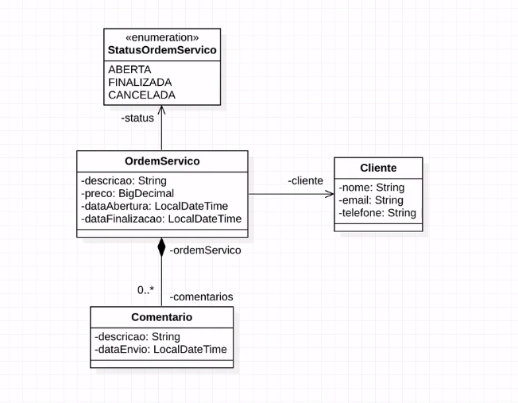

<div align="center">	
		
</div>

<div align="center">
	<h1>OSWorks 📄</h1>	
</div>

### Summary 🔍
- [What is?](#what-is-)
- [Which technologies were used?](#which-technologies-were-used-)
- [Features](#features-)
- [How to run this application?](#how-to-run-this-application-%EF%B8%8F)
<hr>

### What is? 🤔
An API of Order of Services. This was developed during the "Spring REST online Course" by [AlgaWorks](https://www.algaworks.com/). 
<hr>

### Which technologies were used? 💻
- Java and Spring ecossystem (Spring Boot, Spring Framework, Spring Data JPA)
<hr>

### Features ✅<br>
- [Click here](https://drive.google.com/file/d/1DiE8YIS6nK3QmkAp98y6UIEnTBjLPrKz/view?usp=sharing) to access the file that you can download and import to your API client (like Insomnia or Postman) and check all routes and methods that this API supports. To sum up, you can create, update, delete, list all or get users and orders of service information.
<hr>

### How to run this application? ▶️<br>
You must have java installed. If you don't, [click here](https://docs.oracle.com/en/java/javase/11/install/overview-jdk-installation.html) and follow the instructions. <br>
You also have to run MySQL (local or in a Docker container).<br>
Now:<br>
- Clone [this repo](https://github.com/felipejsborges/osworks)
```bash
$ git clone https://github.com/felipejsborges/osworks.git
```

- Go to Project folder
```bash
$ cd osworks
```

- Change IP on `src/main/resources/application.properties`
`spring.datasource.url=jdbc:mysql://<setYourIPHere>:3306/osworks?createDatabaseIfNotExist=True&serverTimezone=UTC`

- Run project
```bash
$ ./mvnw spring-boot:run
```
<hr>

by Felipe Borges<br>
[LinkedIn](https://www.linkedin.com/in/felipejsborges) | [GitHub](https://github.com/felipejsborges)
